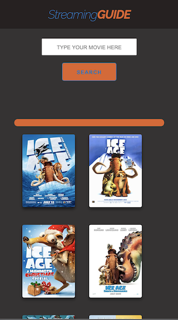

# tester
It is a test folder for team projects. 

Deployed Site link 

 https://imbingz.github.io/tester/
 
 # Project Title

## Table of Content
- [ Project Links ](#Links)
- [ Project Context ](#context)
- [ Project Technologies ](#technologies)
- [ Outcome ](#Outcome)
- [ Screenshots ](#Screenshots)
- [Challenges & What I've Learned](#learned)
- [How To Use](#Installation)
- [Credits & Reference](#Credits)
- [ License ](#License)
- [Author Info](#Author]
#

### 1. Project Links

#### Website Link
https://imbingz.github.io/Ultimate-Streaming-Guide/

#### Work-Files Link
https://github.com/imbingz/Ultimate-Streaming-Guide

### 2. Project Context - User Story
AS A Movieholic  
I WANT to easily find all shows/movies and where they are streamable. 
I WANT to be able to browse movies/shows to find something new to watch. 
SO THAT I can save time and quickly find what I want. 

### 3. Project Technologies 
* Use [omdb API](http://www.omdbapi.com/) and [Utelly API](https://rapidapi.com/utelly/api/utelly) to create an application where the user can search for specific movies and tv shows and see where they are streamable from as well as brows movies by genre and receive basic information about that movie or show (Plot, Rating, Actors, etc)

* It will also feature a clean and polished user interface and be responsive, ensuring that it adapts to multiple screen sizes.

### 4. Outcome
* The user interface is responsive to different devices - mobile, tablets, laptops and larger screen desktops
* The app is dynamic and functional with user search parameters. 
<!-- * Utilized Local Storage to save user search histories.  -->

### 5. Screenshots 

#### Screenshots - Mobile View
<kbd></kbd>

####  Screenshots - Laptop view 
<kbd></kbd>

### 6. How To Use

### 7. Credits & Reference

### 8. Challenges & What I've Learned

### 9. License
##### MIT License

###  10. Author Info

